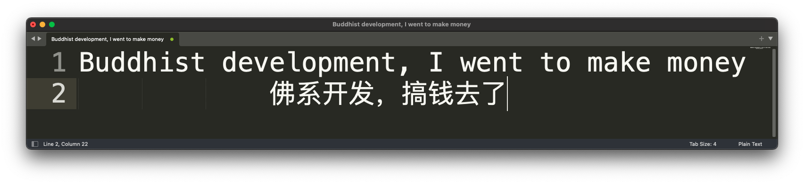

<!--
**pudongping/pudongping** is a ✨ _special_ ✨ repository because its `README.md` (this file) appears on your GitHub profile.

Here are some ideas to get you started:

- 🔭 I’m currently working on ...
- 🌱 I’m currently learning ...
- 👯 I’m looking to collaborate on ...
- 🤔 I’m looking for help with ...
- 💬 Ask me about ...
- 📫 How to reach me: ...
- 😄 Pronouns: ...
- ⚡ Fun fact: ...
-->

<h3 align="center">
    Hi~ Thank you for coming!
    
</h3>

<!-- Typing SVG - https://github.com/DenverCoder1/readme-typing-svg -->
<!-- Typing SVG Fast Demo - https://readme-typing-svg.herokuapp.com/demo/ -->
<p align="center">
    
</p>

<p align="center">
    
    
    <a href="https://pudongping.github.io" target="_blank"></a>
    

[comment]: <> ( if the badge is down, try this website https://vbr.wocr.tk/badge?page_id=pudongping.pudongping&style=plastic&lcolor=590d22&logo=Github&hit=false but this page maybe have bug)
[//]: # (    )

</p>

<br/>

🎉 **Welcome to my GitHub profile!**

<!-- Weird English generator - https://www.dute.org/weird-fonts -->
<!-- Hi, I'm Alex , a passionate self-taught Full Stack web developer and a funny software engineer from China. -->
<!-- I take great care in the architecture and code quality of the things I build.  -->
<!-- I am also an open-source enthusiast and maintainer.  -->

𝑯𝒊, 𝑰'𝒎 ✨ [𝑨𝒍𝒆𝒙](https://pudongping.github.io) ✨ 🥷🏻 , 𝒂 𝒑𝒂𝒔𝒔𝒊𝒐𝒏𝒂𝒕𝒆 𝒔𝒆𝒍𝒇-𝒕𝒂𝒖𝒈𝒉𝒕 𝑭𝒖𝒍𝒍 𝑺𝒕𝒂𝒄𝒌 𝒘𝒆𝒃 𝒅𝒆𝒗𝒆𝒍𝒐𝒑𝒆𝒓 𝒂𝒏𝒅 𝒂 𝒇𝒖𝒏𝒏𝒚 𝒔𝒐𝒇𝒕𝒘𝒂𝒓𝒆 𝒆𝒏𝒈𝒊𝒏𝒆𝒆𝒓 𝒇𝒓𝒐𝒎 𝑪𝒉𝒊𝒏𝒂.  𝑰 𝒕𝒂𝒌𝒆 𝒈𝒓𝒆𝒂𝒕 𝒄𝒂𝒓𝒆 𝒊𝒏 𝒕𝒉𝒆 𝒂𝒓𝒄𝒉𝒊𝒕𝒆𝒄𝒕𝒖𝒓𝒆 𝒂𝒏𝒅 𝒄𝒐𝒅𝒆 𝒒𝒖𝒂𝒍𝒊𝒕𝒚 𝒐𝒇 𝒕𝒉𝒆 𝒕𝒉𝒊𝒏𝒈𝒔 𝑰 𝒃𝒖𝒊𝒍𝒅. 𝑰 𝒂𝒎 𝒂𝒍𝒔𝒐 𝒂𝒏 𝒐𝒑𝒆𝒏-𝒔𝒐𝒖𝒓𝒄𝒆 𝒆𝒏𝒕𝒉𝒖𝒔𝒊𝒂𝒔𝒕 𝒂𝒏𝒅 𝒎𝒂𝒊𝒏𝒕𝒂𝒊𝒏𝒆𝒓. 

<!-- code.gif -->


🛠️ **My Tech Stack and Tools:**

<p>
    <a href="https://github.com/search?q=user%3Apudongping+is%3Arepo+language%3Aphp"></a>
    <a href="https://github.com/search?q=user%3Apudongping+is%3Arepo+language%3AGolang"></a>
    <a href="https://github.com/search?q=user%3Apudongping+is%3Arepo+language%3Apython"></a>
    <a href="https://github.com/search?q=user%3Apudongping+is%3Arepo+language%3AShell"></a>
    <a href="https://github.com/search?q=user%3Apudongping+is%3Arepo+language%3Acss"></a>
    <a href="https://github.com/search?q=user%3Apudongping+is%3Arepo+language%3Ahtml"></a>
    <a href="https://github.com/search?q=user%3Apudongping+is%3Arepo+language%3Ajavascript"></a>
    <a href="https://github.com/search?q=user%3Apudongping+is%3Arepo+language%3Ajavascript"></a>
</p>

<p>
    <a href="#"></a>
    <a href="https://github.com/search?q=user%3Apudongping+is%3Arepo+language%3Avue"></a>
    <a href="https://github.com/search?q=user%3Apudongping+is%3Arepo+language%3ABootstrap"></a>
    <a href="#"></a>
    <a href="#"></a>
    <a href="#"></a>
    <a href="#"></a>
    <a href="#"></a>
    <a href="#"></a>
    <a href="#"></a>
    <a href="#"></a>
    <a href="#"></a>
    <a href="#"></a>
</p>

<p>
    
    
</p>

<p>
    
</p>

<p>
    <a href="#"></a>
    <a href="#"></a>
    <a href="#"></a>
    <a href="#"></a>
    <a href="#"></a>
    <a href="#"></a>
    <a href="https://github.com/search?q=user%3Apudongping+is%3Arepo+language%3Asql"></a>
</p>

<p>
    <a href="#"></a>
    <a href="#"></a>
    <a href="#"></a>
    <a href="#"></a>
    <a href="#"></a>
</p>

<p>
    <a href="#"></a>
    <a href="#"></a>
    <a href="#"></a>
    <a href="#"></a>
    <a href="#"></a>
    <a href="#"></a>
</p>

<p>
    <a href="#"></a>
    <a href="#"></a>
    <a href="#"></a>
    <a href="https://github.com/search?q=user%3Apudongping+is%3Arepo+language%3Amarkdown"></a>
    <a href="#"></a>
    <a href="#"></a>
    <a href="#"></a>
    <a href="#"></a>
    <a href="#"></a>
    <a href="#"></a>
    <a href="#"></a>
    <a href="#"></a>
    <a href="#"></a>
    <a href="#"></a>
    <a href="#"></a>
    <a href="#"></a>
    <a href="#"></a>
</p>


- 📫 How to reach me: ✉️ [Email](mailto:276558492@qq.com) OR 
- 💬 Ask me about anything, I am happy to help;


> 💖 If you like what I do, maybe consider buying me a coffee/tea 🥺 👉 <a href="https://pudongping.github.io/medias/reward/wechat.png" target="_blank"></a> OR <a href="https://pudongping.github.io/medias/reward/alipay.png" target="_blank"></a> 👈

🏆 **Certificate:**

- [RHCSA](https://rhtapps.redhat.com/verify?certId=190-230-177)
- [RHCE](https://rhtapps.redhat.com/verify?certId=190-230-177)


<!-- waka readme - https://github.com/athul/waka-readme -->
📊 **This Week I Spent My Time On:**
<!--START_SECTION:waka-->

```txt
From: 07 May 2025 - To: 14 May 2025

No activity tracked
```

<!--END_SECTION:waka-->

<br/>

---



---

<br/>

## 🔥 My projects:

### Funny

- [pudongping](https://github.com/pudongping/pudongping) - 个人简介
- [hexo-blog](https://github.com/pudongping/pudongping.github.io) - 我正在使用的个人博客项目
- [home-profile](https://github.com/pudongping/home-profile) - 个人开发环境配置信息
- [notes](https://github.com/pudongping/notes) - 编程笔记（以后都在 hexo-blog 上了吧）
- [global-pay-doc](https://github.com/pudongping/global-pay-doc) - global-pay composer 插件包的中文文档
- [load-balancer](https://github.com/pudongping/load-balancer) - 几种负载均衡调度算法，提供 php 和 go 示例
- [polyglot-script-box](https://github.com/pudongping/polyglot-script-box) - 记录工作中常用的脚本，包含且不仅限于 PHP 脚本、Golang 脚本、Python 脚本、Shell 脚本以及 Dockfile 等
- [workflow-action](https://github.com/pudongping/workflow-action) - 自己用到的一些 GitHub Actions
- [hugo-blog](https://github.com/pudongping/hugo-blog) - 使用 Hugo 搭建的一个极简博客
- [mp-vx-insight](https://github.com/pudongping/mp-vx-insight) - 微信公众号小助手，扩展了一键获取微信公众号文章封面图、全部文章等功能

### PHP

- [wise-locksmith](https://github.com/pudongping/wise-locksmith) - 不局限于框架的互斥锁库，用于在高并发场景下提供 PHP 代码的互斥执行。
- [global-pay](https://github.com/pudongping/global-pay) - 简单易用的国际支付宝支付 php composer 插件包，支持花呗分期支付
- [hyperf-throttle-requests](https://github.com/pudongping/hyperf-throttle-requests) - 适配 hyperf 框架的请求频率限流器。功能类似于 laravel 框架的 throttle 中间件
- [hyperf-kit](https://github.com/pudongping/hyperf-kit) - 基于 Hyperf 框架提供的实用工具类或者函数，让开发变得更快、更轻松
- [hyperf-biz-web-api](https://github.com/pudongping/hyperf-biz-web-api) - 基于 hyperf 框架封装的业务 web api 框架，可直接拿过来当项目骨架使用。
- [hyperf-alarm-clock](https://github.com/pudongping/hyperf-alarm-clock) - 计算代码执行时间，超时并发送通知的小工具。
- [hyperf-wise-locksmith](https://github.com/pudongping/hyperf-wise-locksmith) - 适配 hyperf 框架的互斥锁库，用于在高并发场景下提供 PHP 代码的有序执行。
- [weather](https://github.com/pudongping/weather) - php composer 天气查询组件
- [larablog](https://github.com/pudongping/larablog) - 基于 Laravel6.x 构建的博客应用，支持 Markdown，支持图片拖拽上传，基于 RBAC 权限管理系统
- [swoole-learn-demo](https://github.com/pudongping/swoole-learn-demo) - 学习 swoole 时记录的一些 demo
- [hyperf-grpc-demo](https://github.com/pudongping/hyperf-grpc-demo) - 基于 hyperf 框架搭建的 grpc 服务 demo
- [hyperf-json-rpc-demo](https://github.com/pudongping/hyperf-json-rpc-demo) - 使用 hyperf 框架搭建的 json rpc 服务 demo，服务注册中心使用的 consul
- [hyperf-json-rpc-demo-interface](https://github.com/pudongping/hyperf-json-rpc-demo-interface) - hyperf-json-rpc-demo 项目的服务接口类，服务消费者和服务提供者会共用的接口
- [php-grpc-demo](https://github.com/pudongping/php-grpc-demo) - 基于 PHP7.4 搭建的 grpc 服务 demo
- [php-base-container](https://github.com/pudongping/php-base-container) - 简易的 php 容器（类似于 Laravel 的服务容器）
- [php-simple-framework](https://github.com/pudongping/php-simple-framework) - 自己用来练手设计模式封装的一套 php 简易 MVC 框架，支持简单的中间件、DB、ORM 模型等
- [lara-sample-api-5.5](https://github.com/pudongping/lara-sample-api-5.5) - 基于 laravel 5.5 封装的基础方法，以便快速开发符合业务场景 api
- [lara-sample-api](https://github.com/pudongping/lara-sample-api) - 基于 laravel 6.x 封装的基础方法，以便快速开发符合业务场景 api
- [lara-official-website](https://github.com/pudongping/lara-official-website) - 基于 laravel 6.x 开发的官网项目接口
- [smart-assist](https://github.com/pudongping/smart-assist) - 收录一些高频 php 助手函数，提高工作效率

### Go

- [golang-tutorial](https://github.com/pudongping/golang-tutorial) - Go 学习笔记
- [go-zero-tutorial](https://github.com/pudongping/go-zero-tutorial) - 学习 go-zero 时做的笔记
- [goblog](https://github.com/pudongping/goblog) - 使用 go 撸的一个简易 MVC 版本的博客项目
- [go-im-system](https://github.com/pudongping/go-im-system) - 使用 go 写的一个简易即时通讯系统
- [go-chat-room](https://github.com/pudongping/go-chat-room) - 使用 go 写的一个简单聊天室
- [gin-blog-service](https://github.com/pudongping/gin-blog-service) - 学习 gin 框架写的一个简易博客项目
- [go-grpc-service](https://github.com/pudongping/go-grpc-service) - 学习 grpc 时写的一点儿实验代码
- [gin-biz-web-api](https://github.com/pudongping/gin-biz-web-api) -   基于 gin 框架封装的业务 web api 脚手架，可直接拿过来上手开发业务逻辑代码
- [go-tour](https://github.com/pudongping/go-tour) - 使用 Go 编写的一些实用小工具，比如：mysql 数据表结构转结构体、单词转换、时间转换、json 字符串转结构体
- [go-crypto](https://github.com/pudongping/go-crypto) - 封装的一些 go 相关的加密和解密方法
- [golang-consul-grpc-demo](https://github.com/pudongping/golang-consul-grpc-demo) - 基于 Golang 用 consul 做 grpc 的服务注册与发现示例代码
- [golang-grpc-demo](https://github.com/pudongping/golang-grpc-demo) - 基于 Golang 搭建的 grpc 服务 demo
- [go-micro-demo](https://github.com/pudongping/go-micro-demo) - 学习 go-micro 时搭建 grpc 客户端和服务端的一个 demo，注册中心为 etcd
- [go-function-helpers](https://github.com/pudongping/go-function-helpers) - 收录一些高频、实用的 Go 语言助手函数，避免重复造轮子，提高开发效率
- [go-cache-example](https://github.com/pudongping/go-cache-example) - 进程内缓存示例。常用的缓存淘汰算法（FIFO、LFU、LRU）。

### Python

- [document-converter](https://github.com/pudongping/document-converter) - 使用 python3 写的一个 pdf、word 等格式互转的文档转换工具
- [py-TOTP](https://github.com/pudongping/py-TOTP) - 通过密钥生成 TOTP（Time-based One-time Password）的 Python 小工具。如果你需要开启 2FA ，可能你用得着。
- [py-fiesta](https://github.com/pudongping/py-fiesta) - 一些有趣的 python 小项目
- [py-mobile-control](https://github.com/pudongping/py-mobile-control) - 安卓手机自动化脚本


<details>
<summary>其他 </summary>

- [ubiquitous-nodejs](https://github.com/pudongping/ubiquitous-nodejs) - 学习 node.js 时，封装的一个简易 web 脚手架
- [card-robot-backend-page](https://github.com/pudongping/card-robot-backend-page) - 卡密后台页面
- [card-robot-backend-api](https://github.com/pudongping/card-robot-backend-api) - 卡密后台接口
- [card-robot-frontend-page](https://github.com/pudongping/card-robot-frontend-page) - 卡密门户页面
- [card-robot-frontend-api](https://github.com/pudongping/card-robot-frontend-api) - 卡密门户接口
- [card-robot-chat-service](https://github.com/pudongping/card-robot-chat-service) - 卡密聊天系统
- [card-robot-pay-service](https://github.com/pudongping/card-robot-pay-service) - 卡密支付系统
- [software-shop-api](https://github.com/pudongping/software-shop-api) - 软件商城接口
- [software-shop-backend-page](https://github.com/pudongping/software-shop-backend-page) - 软件商城后台页面
- [software-shop-frontend-page](https://github.com/pudongping/software-shop-frontend-page) - 软件商城门户页面
- [lara-shop-cms](https://github.com/pudongping/lara-shop-cms) - 商城 CMS 接口
- [lara-shop-api](https://github.com/pudongping/lara-shop-api) - 商城门户接口
- [hello-mr-anku-pay](https://github.com/pudongping/hello-mr-anku-pay) - 卡密首版码支付代码
- [lara-hello-mr](https://github.com/pudongping/lara-hello-mr) - 卡密首版聊天系统
- [mobile-control](https://github.com/pudongping/mobile-control) - 手机自动化脚本

</details>


---

[//]: # ( see detail: https://metrics.lecoq.io/insights/pudongping  )


---

<!-- details start -->
<details>
<summary>More </summary>

## 📈 My GitHub Stats

**NOTE:** Top Languages does not indicate my skill level or anything like that, it's a GitHub metric of which languages have the most code on GitHub. It's a new feature of [github-readme-stats](https://github.com/anuraghazra/github-readme-stats).

<p align="center">
    
    <!-- Top Langs - https://github.com/anuraghazra/github-readme-stats -->
    
</p>

## 👨‍💻 My GitHub activities of last 31 days.

<!-- https://github.com/ashutosh00710/github-readme-activity-graph -->


## 📘 My own favorite open source projects

<!-- GitHub Extra Pins - https://github.com/anuraghazra/github-readme-stats -->
<a href="https://github.com/pudongping/wise-locksmith.git">
  
</a>
<a href="https://github.com/pudongping/global-pay.git">
  
</a>
<a href="https://github.com/pudongping/hyperf-wise-locksmith.git">
  
</a>
<a href="https://github.com/pudongping/hyperf-throttle-requests.git">
  
</a>
<a href="https://github.com/pudongping/hyperf-kit.git">
  
</a>
<a href="https://github.com/pudongping/hyperf-alarm-clock.git">
  
</a>
<a href="https://github.com/pudongping/smart-assist.git">
  
</a>
<a href="https://github.com/pudongping/go-tour.git">
  
</a>
<a href="https://github.com/pudongping/go-function-helpers.git">
  
</a>
<a href="https://github.com/pudongping/pudongping.github.io.git">
  
</a>

</details>
<!-- details end-->

---

<details>
  <summary><b>Things used in this README</b></summary>
  <br>
  <ol>
    <li>
        <a href="https://github.com/DenverCoder1/readme-typing-svg">Typing SVG</a>
    </li>
    <li>
        <a href="https://www.dute.org/weird-fonts">怪异英文生成器</a>
    </li>
    <li>
      <a href="https://github.com/Nathan13888/VisitorBadgeReloaded">Visitor Badge Reloaded</a>
    </li>
    <li>
      <a href="https://github.com/lowlighter/metrics">Lowlighter's Metrics</a>
    </li>
    <li>
      <a href="https://github.com/athul/waka-readme">waka-readme</a>
    </li>
    <li>
      <a href="https://github.com/anuraghazra/github-readme-stats">github-readme-stats</a>
    </li>
    <li>
        <a href="https://github.com/ashutosh00710/github-readme-activity-graph">github-readme-activity-graph</a>
    </li>
    <li>
        <a href="https://shields.io">Shields.io</a>
    </li>
    <li>
        <a href="https://hits.dwyl.com/">HITS</a>
    </li>
  </ol>
</details>
